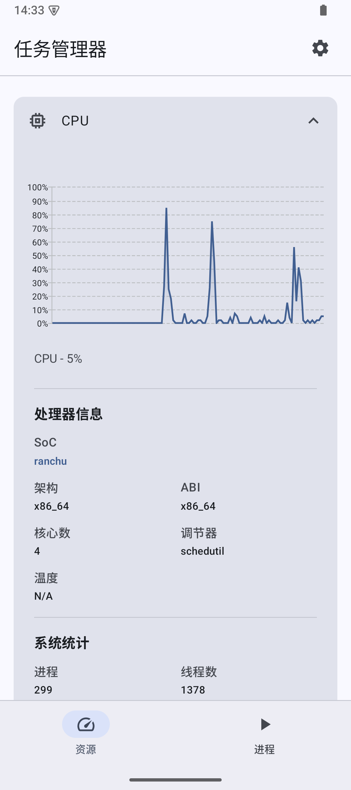
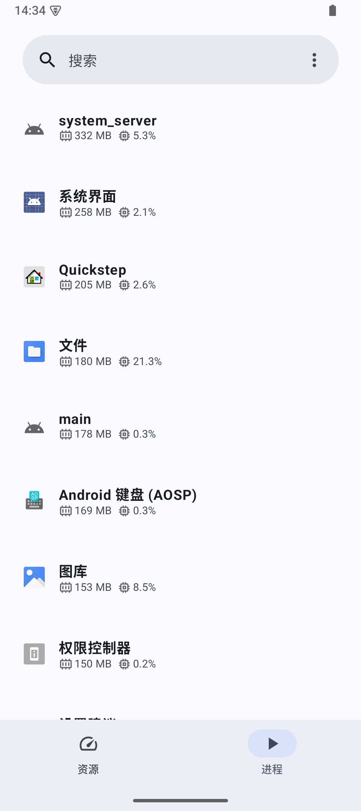
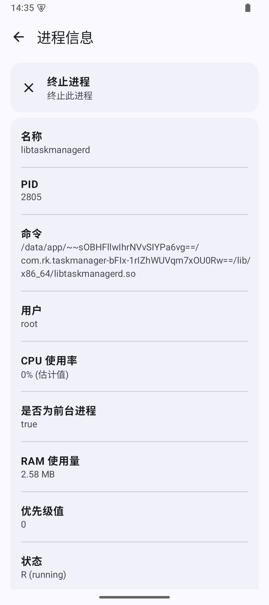

# TaskManager
**Task Manager** 是一款受 GNOME 系统监视器启发的 Android 工具。

**[English](README.md) | 简体中文**

> [!IMPORTANT]
Task Manager 需要 Shizuku/Root 权限才能运行。

# 功能特性
- [x] 监控 CPU 使用率
- [x] 监控内存 (RAM) 使用率
- [x] 监控运行中的 Linux 进程
- [x] 列出进程信息（例如：内存使用量、优先级等）
- [x] 结束 Linux 进程（需要通过 Root 启动 Shizuku）
- [x] 结束 Android 应用

# 屏幕截图

  
    

# 下载

## 觉得这款应用有用吗？ :heart:
给项目点个星（star）来支持它吧 :star:  
此外，欢迎关注中文支持者（**__[Webpage-gh](https://github.com/Webpage-gh)__ & __[Xieansecn](https://github.com/Xieansecn)__**），期待下一个作品！